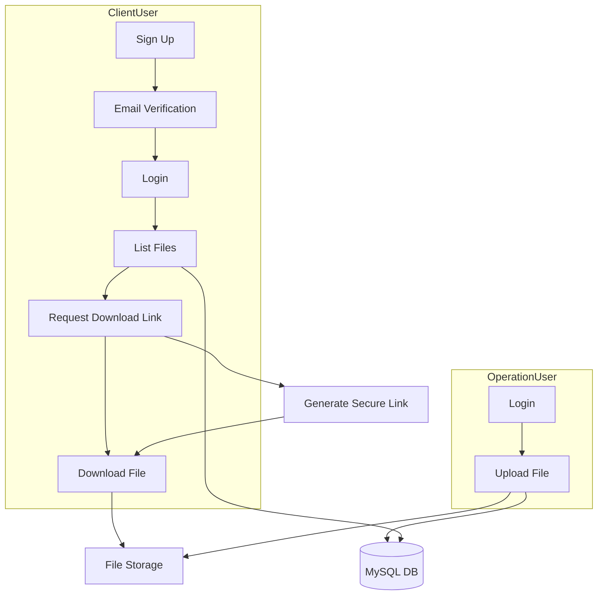
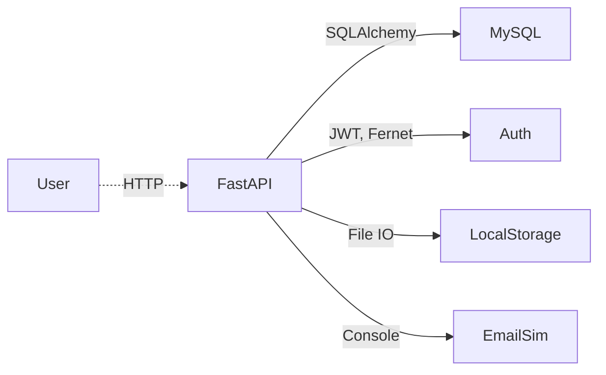
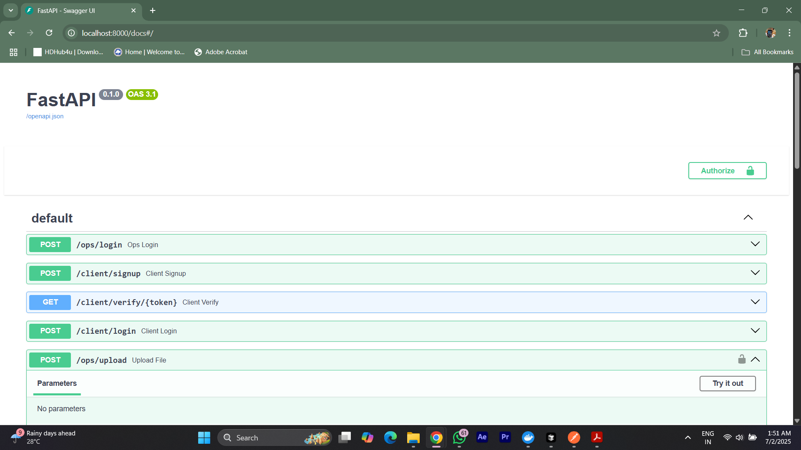
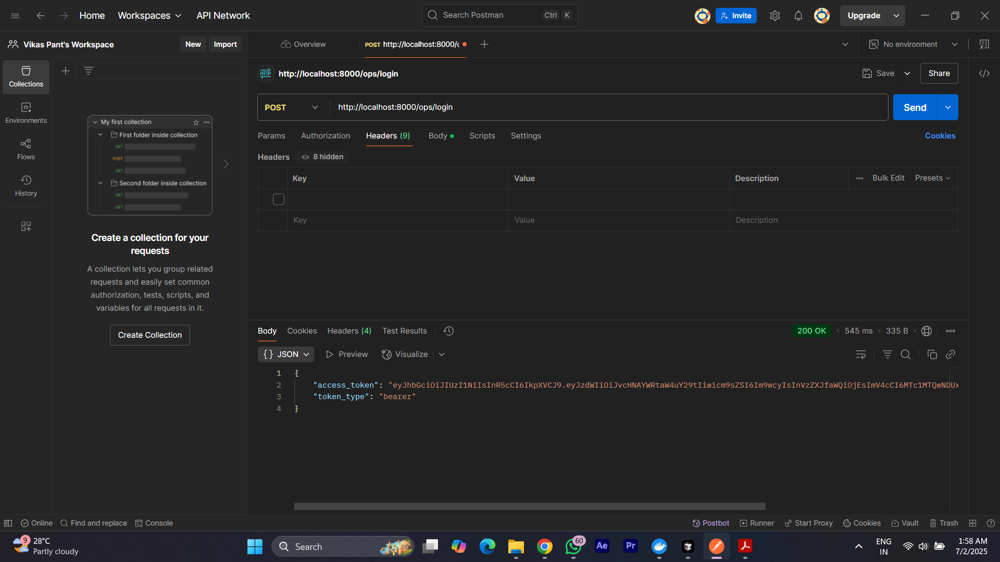

# Secure File Sharing Backend

## Tech Stack
- FastAPI
- MySQL (SQLAlchemy ORM)
- JWT Auth
- Fernet Encryption
- Local File Storage
- Dockerized

## Setup
1. Clone repo
2. Add `.env` file (see sample)
3. Run: `docker-compose up --build`

## Endpoints
### Auth & Account
- `POST /ops/login` (email, password)
- `POST /client/signup` (email, password)
- `GET /client/verify/{token}`
- `POST /client/login` (email, password)

### File Operations
- `POST /ops/upload` (file upload, ops only)
- `GET /client/files` (list files, client only)
- `GET /client/download/{file_id}` (get secure download link)
- `GET /client/secure-download/{token}` (download file)

## Testing
- `pytest` in backend container

## Postman
- See `postman_collection.json` for example requests

---

## Detailed Approach & Architecture

### User Types
- **Operation User**: Can log in and upload files (.pptx, .docx, .xlsx).
- **Client User**: Can sign up, verify email, log in, list files, and download via secure links.

### Security
- **JWT**: Used for authentication and role-based access control.
- **Fernet Encryption**: Used to generate secure, user-specific, and time-limited download tokens.
- **bcrypt**: Used for password hashing.
- **File Validation**: Both extension and MIME type are checked.

### File Storage
- Files are stored locally (can be swapped for S3 in production).
- Metadata is stored in MySQL.

### Email
- Simulated via console log (can be swapped for Mailtrap or SMTP in production).

### Database
- MySQL with SQLAlchemy ORM.
- Two user tables (OperationUser, ClientUser) and one file metadata table.

### Flow Diagram

### Component Diagram

---

## Screenshots

Below are example screenshots of the app in action:

### How to Add Your Own Screenshots
1. Create a folder named `screenshots` in the `backend` directory.
2. Take your screenshots (e.g., of the Swagger UI and Postman) and save them as `swagger-ui.png` and `postman-demo.png` in the `screenshots` folder.
3. The images will automatically appear in the README as shown above.

---

## Notes
- For production, use real email and file storage services.
- Rotate your JWT and Fernet secrets before deploying.
- For any issues, open an issue or PR. 